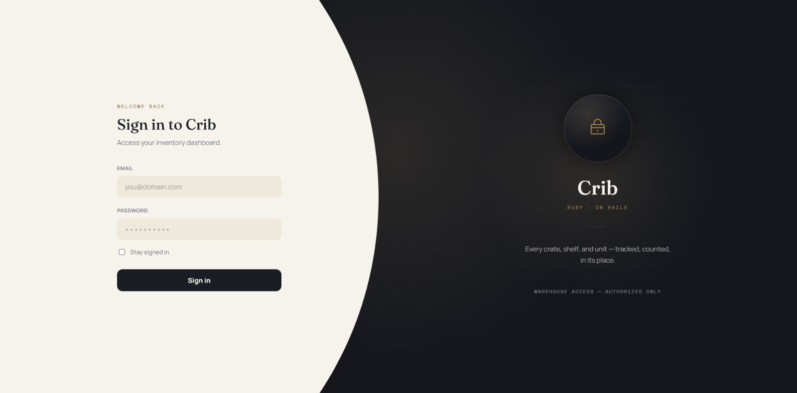
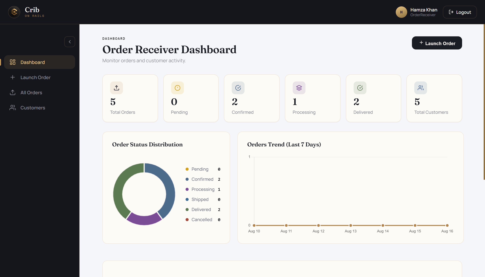

<div align="center">
  

  # Crib on Rails
  
  **A role-based inventory management system built with Ruby on Rails.**

</div>

## 📖 Overview

Crib on Rails is a comprehensive inventory management system currently under active development. It provides a robust, role-based architecture to streamline stock management, order processing, and administrative controls.

**Login Page**
<div align="center">
  
</div>

**Dashboard**
<div align="center">
  
</div>

## ✨ Key Features

- **Role-Based Access Control**: Tailored dashboards and permissions for different user roles.
  - 🛡️ **Admin**: Full system control and reporting.
  - 📦 **Stock Manager**: Comprehensive inventory and stock level management.
  - 📝 **Order Receiver**: Streamlined processing of incoming orders.
- **Product Management**: Complete CRUD operations for inventory items.
- **Stock Tracking**: Real-time monitoring of stock levels.
- **Order Processing**: Efficient workflow for receiving and managing orders.

## 🛠️ Tech Stack

- **Framework**: Ruby on Rails
- **Database**: SQLite3
- **Frontend**: HTML, CSS, Vanilla JS

## 🚀 Getting Started

Follow these steps to set up the project locally.

### Prerequisites

- Ruby
- Bundler
- Rails

### Installation

1. **Clone the repository** (or navigate to the project directory)
   ```bash
   git clone https://github.com/ali38958/Crib-on-Rails.git
   cd Crib-on-Rails
   ```

2. **Install dependencies**
   ```bash
   bundle install
   ```

3. **Set up the database**
   ```bash
   rails db:create db:migrate db:seed
   ```

4. **Create an initial Admin account**
   ```bash
   rails runner "Admin.create!(id: 'admin1', name: 'Admin', email: 'admin@example.com', password: 'password', password_confirmation: 'password')"
   ```
   *Note: With this account, you can now log in as an Admin and create different users.*

5. **Configure Environment Variables & Customer Signup**
   - Open the `.env` file and replace the Gmail app credentials with your own.
   - You can also sign up as a Customer directly from the application.

6. **Start the server**
   ```bash
   rails server
   ```

7. **Access the application**
   Open your browser and navigate to `http://localhost:3000`

## 📁 Project Structure

```text
app/
├── controllers/    # Request handling and business logic routing
├── models/         # Data models and database interactions
├── views/          # HTML templates and UI components
└── assets/         # Static assets like images, CSS, and JS
```

## 📌 Development Roadmap

- [x] Initial project setup
- [ ] Authentication & secure password recovery
- [ ] Role-based access implementation
- [ ] Product CRUD operations
- [ ] Stock management workflow
- [ ] Order processing features
- [ ] Advanced reporting & analytics

## 📄 License

This project is licensed under the MIT License.

## 👤 Author

**Muhammad Ali**  
[GitHub Profile](https://github.com/ali38958) | [Project Repository](https://github.com/ali38958/Crib-on-Rails)
