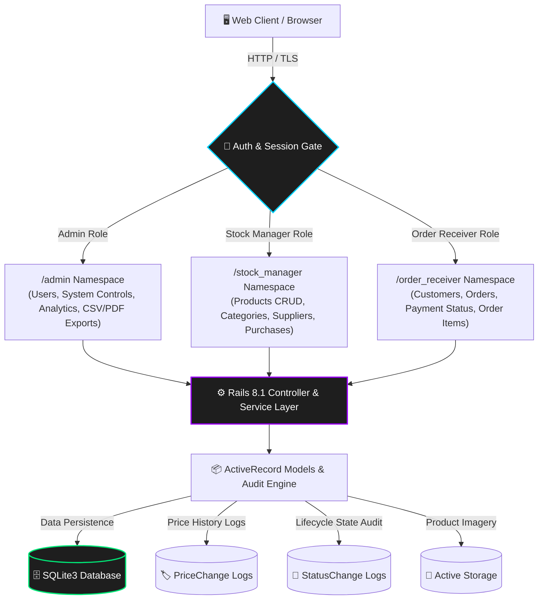

<div align="center">
  

  # 📦 Crib on Rails

  **An enterprise-grade, role-based inventory & order management system engineered with Ruby on Rails.**

  [](https://rubyonrails.org/)
  [](https://www.ruby-lang.org/)
  [](https://www.sqlite.org/)
  [](https://github.com/ali38958/Crib-on-Rails)
  [](#-license)
  [](https://github.com/ali38958)

  [✨ Features](#-why-crib-on-rails) • [📸 Visual Showcase](#-visual-showcase) • [🏗️ Architecture](#-system-architecture) • [👥 Role Workflows](#-role-based-workflows) • [⚡ Quick Start](#-getting-started) • [📄 License](#-license)

</div>

---

## 📖 The Problem It Solves

Modern warehousing, retail, and e-commerce operations often face operational bottlenecks when team members share generic, unsegregated interfaces. Stock managers get overwhelmed by sales notifications, order receivers struggle through complex procurement menus, and administrators lack real-time auditability over price shifts and inventory shrinkage.

**Crib on Rails** is designed from the ground up to solve these operational challenges. It establishes strict, isolated role boundaries (**Admin**, **Stock Manager**, and **Order Receiver**) with dedicated namespaces, instantaneous server-side catalog pagination built to handle **700,000+ records**, comprehensive audit trails for every order status and price transition, and automated session security.

---

## 📸 Visual Showcase

Experience the intuitive, modern interface designed for speed, clarity, and zero cognitive clutter.

### 🔐 1. Authentication & Role-Based Access Gate
*Secure multi-role authentication portal with session persistence, automatic JWT refresh, and OTP password recovery.*

<div align="center">
  
</div>

<br />

### 📊 2. Order Receiver & Real-Time Fulfillment Dashboard
*High-density operations center featuring active order streams, live metrics, status progress lifecycles, and customer management.*

<div align="center">
  
</div>

---

## ✨ Why Crib on Rails?

- 🛡️ **Strict Role-Based Access Control (RBAC)**: Isolated namespaces and dedicated controllers for Admin (`/admin`), Stock Manager (`/stock_manager`), and Order Receiver (`/order_receiver`), ensuring users only access what they need.
- ⚡ **High-Scale Inventory Processing**: Engineered for 700k+ records with Kaminari pagination, server-side filtering, and indexed SQL queries for sub-millisecond response times.
- 🔄 **Audited Order Lifecycle**: Complete order state machine (`Launch` ➔ `Process` ➔ `Completed` / `Cancelled`) with every transition timestamped in `StatusChange` records alongside partial and full payment tracking.
- 📈 **Interactive Analytics & Reporting**: Real-time Chart.js visual telemetry for revenue and order distributions, plus instant one-click CSV and print-optimized PDF reporting.
- 🔐 **Dual Auth & Password Recovery**: Session JWT token auto-refresh combined with OTP-based transactional email password resets via SMTP.
- 🖼️ **Drag-and-Drop Product Media**: Active Storage integration for seamless product asset uploads, drag-and-drop imagery, and dynamic previews.
- 🏷️ **Price History Auditing**: Automatic `PriceChange` logs capturing price fluctuations over time to preserve historic sales margins.

---

## 🏗️ System Architecture

Crib on Rails leverages a clean, modular Model-View-Controller architecture with isolated role namespaces and robust auditing layers:



---

## 👥 Role-Based Workflows

| Role | Namespace | Primary Responsibilities & Capabilities |
| :--- | :--- | :--- |
| 🛡️ **Admin** | `/admin` | Full system governance, user account management (Admins, Stock Managers, Order Receivers), system-wide revenue analytics via Chart.js, and CSV/PDF report generation. |
| 📦 **Stock Manager** | `/stock_manager` | Comprehensive product catalog management, drag-and-drop image uploads, price adjustments with automatic history logs, supplier profiles, and incoming purchase tracking. |
| 📝 **Order Receiver** | `/order_receiver` | Customer onboarding, order creation and item configuration, lifecycle status progression (`Launch` ➔ `Process` ➔ `Complete`), and payment reconciliation (Price Paid vs Total). |

---

## 🛠️ Tech Stack

| Layer | Technology | Purpose & Rationale |
| :--- | :--- | :--- |
| **Backend Framework** | Ruby on Rails 8.1 | High-productivity, convention-over-configuration web framework. |
| **Language** | Ruby 3.x | Object-oriented core logic and expressive domain modeling. |
| **Database** | SQLite3 | Fast, reliable relational storage optimized with index caching. |
| **Frontend** | HTML5, CSS3, Vanilla JS | Ultra-fast, lightweight UI without bloated client frameworks. |
| **Data Visualization**| Chart.js | Dynamic, responsive revenue and order volume charts. |
| **File Storage** | Active Storage | Native asset management for high-resolution product media. |
| **Authentication** | BCrypt + JWT Refresh | Secure password hashing, token auto-refresh, and OTP recovery. |

---

## ⚡ Getting Started

Follow these steps to set up and run Crib on Rails on your local machine.

### 📋 Prerequisites

Ensure you have the following installed on your system:
- **Ruby**: `v3.1+` (or matching `.ruby-version`)
- **Bundler**: `gem install bundler`
- **Rails**: `v8.1+`
- **SQLite3**

---

### 🚀 Installation & Setup

1. **Clone the repository**
   ```bash
   git clone https://github.com/ali38958/Crib-on-Rails.git
   cd Crib-on-Rails
   ```

2. **Install Ruby dependencies**
   ```bash
   bundle install
   ```

3. **Initialize the database and run migrations**
   ```bash
   rails db:create db:migrate db:seed
   ```

4. **Bootstrap the initial Administrator account**
   ```bash
   rails runner "Admin.create!(id: 'admin1', name: 'Admin', email: 'admin@example.com', password: 'password', password_confirmation: 'password')"
   ```
   > 💡 *Note: Once logged in as Admin, you can provision additional Stock Managers, Order Receivers, and Admins from the dashboard.*

5. **Configure Environment Variables (Optional for Password Reset Emails)**
   - Copy or edit your `.env` file with your SMTP credentials:
     ```env
     GMAIL_USERNAME=your-email@gmail.com
     GMAIL_APP_PASSWORD=your-gmail-app-password
     ```

6. **Start the Rails development server**
   ```bash
   rails server
   ```

7. **Access the application**
   Open your browser and navigate to:
   ```text
   http://localhost:3000
   ```

---

## 📁 Project Structure

```text
Crib_on_Rails/
├── app/
│   ├── assets/             # CSS stylesheets, JavaScript files, and imagery
│   ├── controllers/        # Request controllers isolated by namespace:
│   │   ├── admin/          # Admin governance & reporting controllers
│   │   ├── stock_manager/  # Inventory, supplier, & purchase controllers
│   │   └── order_receiver/ # Customer & order processing controllers
│   ├── models/             # ActiveRecord models (Product, Order, Customer, etc.)
│   └── views/              # Semantic ERB templates styled with custom design tokens
├── assets/                 # Brand logos and visual showcase assets
├── config/                 # Routes, database config, and environment initializers
├── db/                     # Migrations, schema definitions, and seed data
├── screenshots/            # UI walkthrough images for documentation
└── public/                 # Static error pages and browser icons
```

---

## 📌 Development Roadmap

- [x] Initial project setup & Rails 8.1 architecture
- [x] Multi-tenant role authentication & JWT auto-refresh
- [x] Secure OTP password reset flow via ActionMailer
- [x] Product catalog CRUD with drag-and-drop Active Storage uploads
- [x] High-performance Kaminari search & pagination (700k+ items)
- [x] Order lifecycle state machine with `StatusChange` history logs
- [x] Supplier management & incoming purchase stock receipts
- [x] Real-time Chart.js visual analytics & CSV/PDF report exports
- [ ] Multi-currency support for international fulfillment
- [ ] Webhook notifications for third-party logistics dispatch

---

## 📄 License

This project is released under a **Personal, Non-Commercial Use Agreement**. Unauthorized redistribution, public mirroring, re-uploading binaries or source code, commercial SaaS hosting, or claiming ownership is strictly prohibited.

For complete details, please see the [LICENSE.md](LICENSE.md) file.

---

## 👤 Author & Support

**Muhammad Ali**

- **GitHub Profile**: [@ali38958](https://github.com/ali38958)
- **Project Repository**: [ali38958/Crib-on-Rails](https://github.com/ali38958/Crib-on-Rails)

<div align="center">
  <sub>Built with ❤️ and Rails. ⭐ Star the repository if you find it helpful!</sub>
</div>
